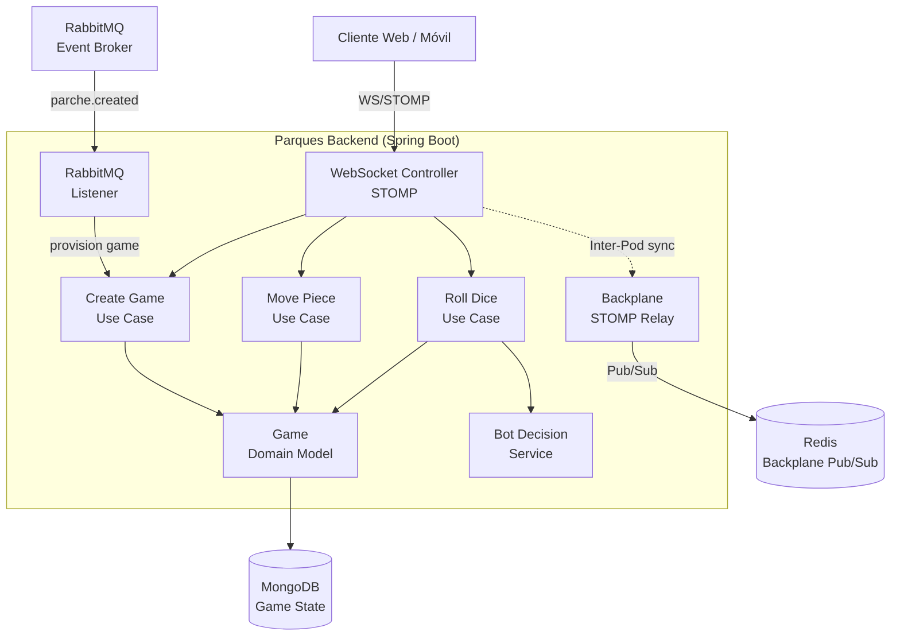
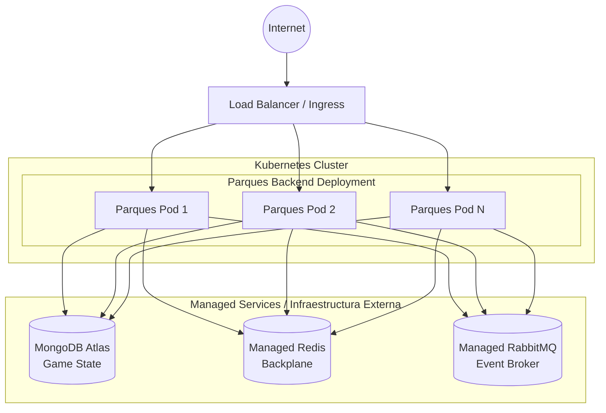

# Parques Backend Microservice

Este microservicio es responsable de gestionar partidas multijugador del juego de mesa "Parques" (Ludo colombiano) dentro de la plataforma U-Link. Implementa la lógica completa del juego con soporte para inteligencia artificial (bots), comunicación en tiempo real vía WebSockets, y persistencia del estado del juego en MongoDB. Forma parte del ecosistema **PATRICIA**.

## ¿Qué hace el microservicio?

1. **Gestión de Partidas Multijugador:** Permite crear partidas de Parques, unirse a ellas, y gestionar el ciclo de vida completo de una partida (creación, jugando, finalizada). Cada partida tiene un tablero, piezas por jugador, y un turno activo.
2. **Lógica del Juego Completa:** Implementa todas las reglas del Parques colombiano: lanzamiento de dados, movimiento de piezas, captura de oponentes, reglas de salida, y condiciones de victoria. Validación estricta de movimientos legales.
3. **Inteligencia Artificial (Bots):** Incluye un servicio de decisiones para bots (`ParquesBotDecisionService`) que puede jugar automáticamente contra humanos, permitiendo partidas cuando no hay suficientes jugadores.
4. **Comunicación en Tiempo Real:** Utiliza WebSockets (STOMP) para transmitir acciones del juego (movimientos de piezas, lanzamientos de dados, cambios de turno) a todos los jugadores en tiempo real.
5. **Sincronización Multi-nodo (Backplane):** Implementa Redis Pub/Sub como backplane para sincronizar el estado del juego entre múltiples instancias del servicio.
6. **Integración Orientada a Eventos:** Escucha eventos de dominio a través de RabbitMQ (AMQP), como `parche.created`, para provisionar partidas vinculadas a parches automáticamente.

---

## Parámetros de Calidad y Principios de Diseño

* **Principios SOLID:**
  * *Single Responsibility Principle (SRP):* Separación clara entre controladores WebSocket (`ParquesWebSocketController`), casos de uso (`CreateGameUseCase`, `MovePieceUseCase`, `RollDiceUseCase`), dominio (`Game`), inteligencia artificial (`ParquesBotDecisionService`), y backplane.
  * *Dependency Inversion Principle (DIP):* Inyección de dependencias a través de constructores inyectados.
* **Alta Disponibilidad y Escalabilidad Horizontal:** Estado del juego persistido en MongoDB, backplane Redis para sincronización entre pods.
* **Tolerancia a Fallos:** *Health Probes* (liveness, readiness) a través de Spring Boot Actuator.
* **Testing y Code Coverage:** *Coverage Gate* con JaCoCo (mínimo 80% en líneas), con suite de tests exhaustiva (21 archivos de test).

---

## Diagrama de Arquitectura



---

## Diagrama de Despliegue



## Tecnologías Principales

* Java 21
* Spring Boot 3.2.4
* Spring Web, Spring WebSockets
* Spring Data MongoDB
* Spring Data Redis (Backplane)
* Spring AMQP (RabbitMQ)
* Spring Boot Actuator
* Jackson Databind
* Springdoc OpenAPI 2.5.0
* JaCoCo (Coverage)

## API Documentation

The service exposes a RESTful API documented via OpenAPI. Once the application is running, you can explore the API using the Swagger UI available at:
```
http://<HOST>:<PORT>/swagger-ui.html
```
The OpenAPI specification is generated automatically by Springdoc and can be accessed at `/v3/api-docs`.

## Running Locally

### Prerequisites
- Java 21 (or newer)
- Maven 3.9+
- Docker (optional, for containerized execution)
- Access to a MongoDB instance (local or remote)
- Access to a Redis instance (local or remote)
- Access to a RabbitMQ broker (local or remote)

### Steps
1. Clone the repository and navigate to the project root.
2. Set the required environment variables (see *Configuration* section below).
3. Build the project:
   ```
   ./mvnw clean package
   ```
4. Run the application:
   ```
   java -jar target/parques-0.0.1-SNAPSHOT.jar
   ```
   The service will start on port **8085** by default.

## Docker Deployment

A Dockerfile is provided for containerizing the microservice. Build and run the image with:
```bash
docker build -t parques-backend:latest .

docker run -d \
  -p 8085:8085 \
  -e "SPRING_PROFILES_ACTIVE=prod" \
  -e "SPRING_DATA_MONGODB_URI=mongodb://mongo:27017/parques" \
  -e "SPRING_REDIS_HOST=redis" \
  -e "SPRING_RABBITMQ_HOST=rabbitmq" \
  parques-backend:latest
```

The service expects external services (MongoDB, Redis, RabbitMQ) to be reachable via the provided hostnames. When deploying to Kubernetes, use the *Deployment* diagram above and configure the corresponding `ConfigMap`/`Secret` resources.

## Configuration

The service requires the following environment variables:

| Variable | Description | Required |
|----------|-------------|----------|
| `SPRING_DATA_MONGODB_URI` | MongoDB connection URI | Yes |
| `SPRING_REDIS_HOST` | Redis host for backplane | Yes |
| `SPRING_RABBITMQ_HOST` | RabbitMQ host for domain events | Yes |
| `SPRING_RABBITMQ_USERNAME` | RabbitMQ username | Yes |
| `SPRING_RABBITMQ_PASSWORD` | RabbitMQ password | Yes |
| `BACKPLANE_ENABLED` | Enable Redis backplane for multi-pod sync | No (default: false) |
| `PERSISTENCE_MODE` | Game persistence mode: `mongo` or `memory` | No (default: mongo) |

## Testing

Unit and integration tests are located under `src/test/java`. Run the full test suite with:
```bash
./mvnw verify
```
Coverage is enforced by JaCoCo with a minimum of **80%** line coverage. The test suite includes comprehensive coverage of game logic, bot decisions, and WebSocket interactions (21 test files).

## Contributing

Contributions are welcome! Please follow these steps:
1. Fork the repository.
2. Create a feature branch (`git checkout -b feature/awesome-feature`).
3. Implement your changes, ensuring existing tests pass and adding new tests if needed.
4. Submit a Pull Request with a clear description of the changes.

All contributions must adhere to the project's coding standards and pass the CI pipeline.

## License

This project is licensed under the **Apache License 2.0**. See the `LICENSE` file for details.
